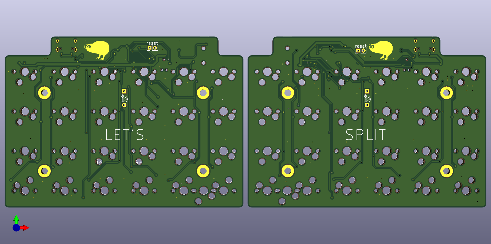
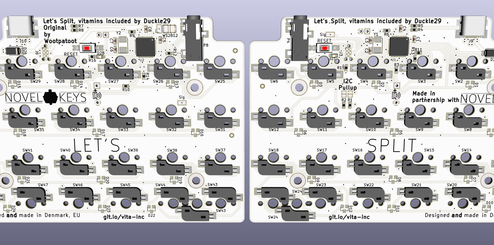

# Vitamins Included

This repository contains all files necesarry to make the Let's split keyboard variant "Vitamins included"

The kit for these PCBs are sold at [Novelkeys](https://novelkeys.xyz), 
the firmware for the keyboard is [QMK](https://github.com/qmk/qmk_firmware/tree/master/keyboards/vitamins_included)

To edit these, you need kicad 5 or later

