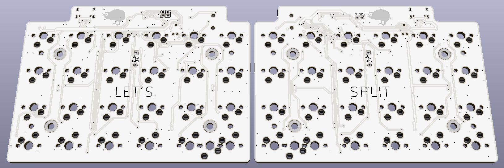

# Vitamins Included

This repository contains all files necesarry to make the Let's split keyboard variant "Vitamins included"

The kit for these PCBs are sold at [Novelkeys](https://novelkeys.xyz), the firmware for the keyboardis [QMK](https://github.com/qmk/qmk_firmware/tree/master/keyboards/vitamins_included)

To edit these, you need kicad nightly at least `version 5.0-dev-unknown-9241a39~61~ubuntu17.10.1, release build` or equivalente for your OS

