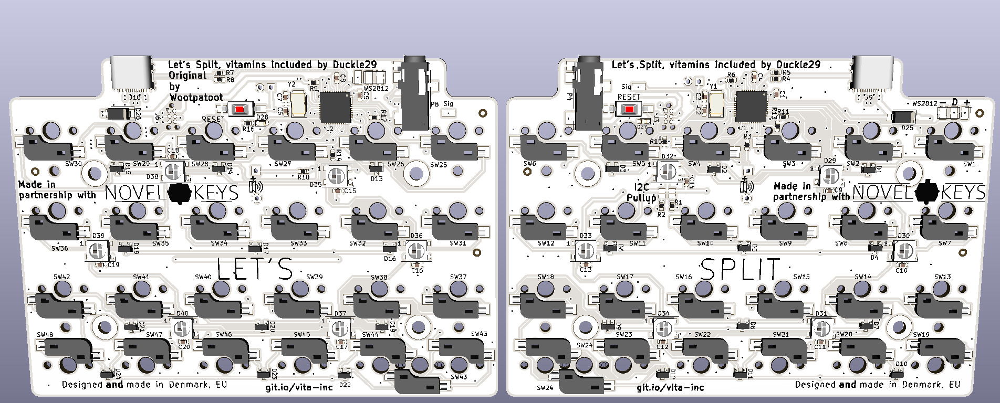

View this project on [CADLAB.io](https://cadlab.io/project/1862). 
[iBOM](https://duckle29.github.io/Vitamins-included/)

# Vitamins Included

This repository contains all files necesarry to make the Let's split keyboard variant "Vitamins included"

Files are not guarranteed to be in sync outside of tagged releases. They aren't on releases either, but they should be ;)

The kit for these PCBs are sold at [Novelkeys](https://novelkeys.xyz), 
the firmware for the keyboard is [QMK](https://github.com/qmk/qmk_firmware/tree/master/keyboards/vitamins_included)

To edit these, you need kicad 5 or later. Missing footprints can be found [here](https://github.com/Duckle29/kicad-footprints), on seperate branches, but should be included in KiCAD libraries eventually. You can check for open pull-requests by me on the upstream repo to see the status on those.

